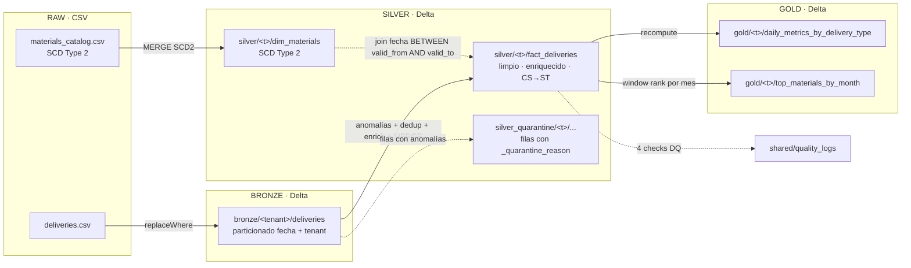

# SAAS Data Platform

Plataforma multi-tenant para procesar entregas de productos con el patrón **Medallion** (Bronze → Silver → Gold) sobre **PySpark + Delta Lake**. Corre localmente y está pensada para migrar 1-a-1 a Databricks Runtime 15.x LTS con un cambio de configuración (sin tocar código).

Es mi entrega de la prueba técnica de Senior Data Engineer para Apex Digital / M5. La arquitectura viene dada en el enunciado — mi trabajo fue implementarla con buen criterio y documentar las decisiones, no rediseñarla.

> **Autor:** Daniel Santos · Lima, Perú · [@Danzstorm](https://github.com/Danzstorm)
> **Repo:** https://github.com/Danzstorm/saas-data-platform

---

## Índice

1. [Por qué existe este pipeline](#1-por-qué-existe-este-pipeline)
2. [Cómo está organizado el código](#2-cómo-está-organizado-el-código)
3. [Vista de la arquitectura](#3-vista-de-la-arquitectura)
4. [Pre-requisitos](#4-pre-requisitos)
5. [Instalación](#5-instalación)
6. [Cómo se corre](#6-cómo-se-corre)
7. [Tests y linter](#7-tests-y-linter)
8. [Configuración](#8-configuración)
9. [Onboarding de un tenant nuevo](#9-onboarding-de-un-tenant-nuevo)
10. [Despliegue en Databricks](#10-despliegue-en-databricks)
11. [Decisiones que tomé y por qué](#11-decisiones-que-tomé-y-por-qué)
12. [Lo que dejé fuera (con motivo)](#12-lo-que-dejé-fuera-con-motivo)
13. [Documentos complementarios](#13-documentos-complementarios)

---

## 1. Por qué existe este pipeline

El input son dos archivos: el `global_mobility_data_entrega_productos.csv` (unas 3 100 entregas reales para 6 países / tenants en Q1-Q2 2025, con anomalías intencionales) y un catálogo de materiales en formato SCD Type 2.

La salida es una capa Gold lista para análisis con métricas por tenant, fecha y tipo de entrega. En medio, una capa Bronze que conserva el dato crudo y una Silver limpia, normalizada y enriquecida.

El "valor" que entrega el pipeline está en tres lados:

- **Multi-tenant real**, no por filtro WHERE. Cada tenant tiene su propio path / schema, su propia partición física. Onboardear un país nuevo es agregar un YAML, no tocar código.
- **Idempotencia** verificable. Reejecutar el mismo rango produce el mismo resultado — `replaceWhere` en Bronze/Gold/Quarantine y `MERGE INTO` en Silver lo garantizan.
- **Calidad observable**. Cada corrida persiste resultados de validaciones en una tabla Delta compartida; el `fail_on_critical` puede abortar antes de Gold si algo crítico falla.

---

## 2. Cómo está organizado el código

```
saas-data-platform/
├── src/saas_pipeline/      # el código del pipeline
│   ├── cli.py              # entrypoint Typer
│   ├── config.py           # loader OmegaConf jerárquico
│   ├── spark.py            # SparkSession + Delta
│   ├── paths.py            # composición de rutas
│   ├── schemas.py          # esquemas explícitos del CSV
│   ├── utils.py            # ids, date_range
│   ├── bronze.py           # CSV → Delta
│   ├── silver.py           # SCD2 + anomalías + enrich
│   ├── gold.py             # daily_metrics + top_materials
│   └── quality.py          # checks + quality_logs
├── config/                  # base + env/{dev,qa,main} + tenants/*
├── tests/                   # 31 tests (no-Spark + Spark + E2E fixture)
├── docs/                    # architecture, observations, infra, onboarding
├── mentoring/              # ejercicio del Anexo A
├── data/raw/               # CSVs de entrada (versionados)
└── .github/workflows/      # CI
```

Un archivo por responsabilidad. Cuando alguien revisa el repo por primera vez puede ir `bronze.py` → `silver.py` → `gold.py` y seguir la historia.

---

## 3. Vista de la arquitectura

Para el detalle completo (con 15 diagramas Mermaid del flujo de SCD2, manejo de anomalías, idempotencia y CI), ver **[`docs/architecture.md`](docs/architecture.md)**.



> **Mapeo a Unity Catalog:** `data/<layer>/<tenant>/<table>/` ↔ `saas_<env>.<layer>_<tenant>.<table>`. La migración a Databricks es un cambio de configuración, no de código.

---

## 4. Pre-requisitos

| | Versión | Notas |
|---|---|---|
| **Python** | 3.11 | uv lo gestiona automáticamente. DBR 15.x LTS usa la misma versión. |
| **Java JDK** | 17 LTS | Lo pide PySpark 3.5. Microsoft OpenJDK o Temurin, da igual. |
| **uv** | ≥ 0.4 | https://github.com/astral-sh/uv |
| **Git** | reciente | |
| **`gh` CLI** | opcional | para PRs desde terminal |

En Windows hay un paso extra: PySpark necesita `winutils.exe` y `HADOOP_HOME` para escribir al filesystem. Ver sección 5 — está documentado.

```powershell
java -version       # 17.x.x
uv --version        # 0.4 o superior
```

Si Java no está instalado: `winget install Microsoft.OpenJDK.17`. Reabrí la terminal después.

---

## 5. Instalación

### Linux / macOS / WSL

```bash
git clone https://github.com/Danzstorm/saas-data-platform.git
cd saas-data-platform
uv sync --extra dev
```

### Windows + PowerShell

```powershell
git clone https://github.com/Danzstorm/saas-data-platform.git
cd saas-data-platform
uv sync --extra dev

# Hadoop winutils (sólo Windows, una vez)
New-Item -ItemType Directory C:\hadoop\bin -Force | Out-Null
Invoke-WebRequest "https://raw.githubusercontent.com/cdarlint/winutils/master/hadoop-3.3.6/bin/winutils.exe" -OutFile C:\hadoop\bin\winutils.exe
Invoke-WebRequest "https://raw.githubusercontent.com/cdarlint/winutils/master/hadoop-3.3.6/bin/hadoop.dll" -OutFile C:\hadoop\bin\hadoop.dll
[Environment]::SetEnvironmentVariable('HADOOP_HOME', 'C:\hadoop', 'User')
[Environment]::SetEnvironmentVariable('JAVA_HOME', 'C:\Program Files\Microsoft\jdk-17.0.19.10-hotspot', 'User')
# Cerrar y reabrir la terminal para que las variables tomen efecto
```

> El paso de winutils sólo es necesario en Windows. En Linux/macOS, PySpark anda directo con Java instalado.

---

## 6. Cómo se corre

### Opción A — directo

```powershell
# Pipeline completo (Bronze → Silver → Gold) para todos los tenants
uv run saas-pipeline run --layer all --tenant all --env dev `
    --start-date 2025-01-01 --end-date 2025-06-30
```

### Opción B — capa por capa

```powershell
uv run saas-pipeline run --layer bronze --tenant pe --env dev `
    --start-date 2025-03-01 --end-date 2025-03-07

uv run saas-pipeline run --layer silver --tenant pe --env dev `
    --start-date 2025-03-01 --end-date 2025-03-07

uv run saas-pipeline run --layer gold --tenant pe --env dev `
    --start-date 2025-03-01 --end-date 2025-03-07
```

### Opción C — Makefile

```powershell
make run-all                                # defaults: tenant=all, env=dev, Q1-Q2 2025
make run-all TENANT=pe START=2025-03-01 END=2025-03-31
make run-bronze TENANT=sv
```

### Flags

| Flag | Default | |
|---|---|---|
| `--layer` | `all` | `bronze` / `silver` / `gold` / `all` |
| `--tenant` | `all` | `sv` / `hn` / `jm` / `ec` / `pe` / `gt` / `all` |
| `--env` | `dev` | `dev` / `qa` / `main` |
| `--start-date` | (requerido) | `YYYY-MM-DD` |
| `--end-date` | (requerido) | `YYYY-MM-DD` |
| `--fail-fast` | `false` | aborta toda la corrida si un tenant falla |
| `--fail-on-critical` | `false` | aborta antes de Gold si un check critical falla |

### Qué esperar al correr

Con los 6 tenants y el rango Q1-Q2 2025 completo, esto es lo que sale:

| Tenant | Input | Descartados | En cuarentena | Persistidos |
|---|---|---|---|---|
| SV | 800 | 46 | 32 | 722 |
| HN | 700 | 45 | 29 | 626 |
| JM | 400 | 17 | 17 | 366 |
| EC | 500 | 30 | 28 | 442 |
| PE | 300 | 24 | 9 | 267 |
| GT | 400 | 18 | 8 | 374 |
| **Total** | **3 100** | **180** | **123** | **2 797** |

- **Descartados:** `tipo_entrega` no es ZPRE/ZVE1/Z04/Z05 (mayormente COBR y Z99). Se cuentan, no se persisten.
- **Cuarentena:** `fecha_proceso` nula/inválida, `cantidad ≤ 0` o nula, `precio` nulo, o `material` que no existe en el catálogo. Van a `data/silver_quarantine/<tenant>/fact_deliveries/`.

---

## 7. Tests y linter

```powershell
# Suite completa (31 tests, ~50s en mi máquina)
uv run pytest -v

# Sólo los rápidos (sin Spark, < 100 ms)
uv run pytest tests/test_config.py tests/test_utils.py -v

# Linter
uv run ruff check src tests
```

Atajos: `make test` y `make lint`.

Los tests están separados en tres niveles:

- **Sin Spark** (config, utils): instantáneos. Se corren en cada commit local.
- **Con Spark** (silver transforms, SCD2 join, quality checks): usan un SparkSession local con Delta. Se saltan automáticamente si no hay Java.
- **E2E** (`test_e2e_pipeline.py`): corre el pipeline completo contra un fixture chico de 12 filas. Atrapa bugs de integración (esquemas que no encajan entre capas, `replaceWhere` mal armado).

CI corre los 31 en GitHub Actions con `setup-java@v4`.

---

## 8. Configuración

OmegaConf con tres niveles. Precedencia: el más a la derecha gana.

```
config/base.yaml                      # defaults globales
    ↓ overrides
config/env/{dev,qa,main}.yaml         # por ambiente
    ↓ overrides
config/tenants/{sv,hn,jm,ec,pe,gt}.yaml  # por tenant
    ↓ overrides
CLI args (--start-date, --tenant, ...)
```

Las **reglas de negocio están en `base.yaml`**, no en código:

```yaml
business:
  cs_to_st_factor: 20
  valid_delivery_types: [ZPRE, ZVE1, Z04, Z05]
  routine_types: [ZPRE, ZVE1]
  bonus_types: [Z04, Z05]
```

Si negocio mañana agrega `Z06` como tipo de entrega válido, es un cambio de una línea en YAML y un PR — no requiere tocar `silver.py`.

Las **rutas y políticas operativas** son por ambiente (`env/qa.yaml` activa `fail_on_critical=true`, dev no). Y los **datos del país** (timezone, currency) van por tenant.

---

## 9. Onboarding de un tenant nuevo

El flujo está en [`docs/onboarding-tenant.md`](docs/onboarding-tenant.md) en detalle. Pero el resumen es:

1. PR en el repo de Terraform: agregar una nueva instancia del módulo `tenant` (provisiona schemas, containers, grupos).
2. `terraform apply`.
3. PR aquí: crear `config/tenants/<código>.yaml` y agregar el código a `tenants.known` en `base.yaml`.
4. Smoke run local: `make run-all TENANT=<código>`.
5. Smoke run en Databricks dev.
6. Listo.

No tocás código en ningún paso. Si tenés que tocar código, algo en el paso 1 está faltando o el tenant nuevo tiene un caso especial que merece su propia conversación.

---

## 10. Despliegue en Databricks Free Edition

**Estado: deployado, corriendo, tablas en Unity Catalog ✅.** Para el detalle completo (con todos los gotchas y workarounds que tuve que resolver), ver [`docs/databricks-free-edition.md`](docs/databricks-free-edition.md).

### Lo que hay armado en el repo

```
saas-data-platform/
├── config/env/databricks.yaml         # paths /Volumes/saas_dev/shared/... (POSIX UC)
├── databricks.yml                     # bundle DAB (deploy via bundle pendiente por bug upstream)
├── src/saas_pipeline/
│   ├── databricks_entrypoint.py       # job entrypoint (thin wrapper)
│   └── pipeline.py                    # orchestration compartida con cli.py local
├── scripts/register_uc_tables.py      # registra Delta files como tablas UC
└── docs/databricks-free-edition.md    # guia paso a paso replicable
```

### Resultado del run real

Run `229721693750716` en mi workspace Free Edition, tenant `pe`, rango Q1-Q2 2025:

| Tabla UC | Filas |
|---|---|
| `saas_dev.bronze_pe.deliveries` | 300 |
| `saas_dev.silver_pe.fact_deliveries` | 267 |
| `saas_dev.silver_pe.dim_materials` | 35 |
| `saas_dev.silver_pe.fact_deliveries_quarantine` | 9 |
| `saas_dev.gold_pe.daily_metrics_by_delivery_type` | 101 |
| `saas_dev.gold_pe.top_materials_by_month` | 60 |
| `saas_dev.shared.quality_logs` | 4 |

**Idéntico al run local** — el código del pipeline es 100% portable. La única diferencia es la config (`config/env/dev.yaml` vs `config/env/databricks.yaml`) y dos cosas que aísla el `databricks_entrypoint.py`: ANSI mode off (para `to_date` con fechas inválidas) y bootstrap de `sys.path` cuando `__file__` no existe bajo ipykernel.

### Limitaciones reales de Free Edition que tuve que resolver

| Limitación | Workaround aplicado |
|---|---|
| Sólo serverless compute (no clusters dedicados) | Job declara `environment_key` + `spec.client="2"` |
| RDD API no implementada en Spark Connect | `df.rdd.isEmpty()` → `df.limit(1).count() == 0` |
| `__file__` undefined en ipykernel | Fallback a `sys.argv[0]` en entrypoint |
| ANSI mode on por default | `spark.conf.set('spark.sql.ansi.enabled','false')` en entrypoint |
| Catálogos requieren default storage | Crear via SQL warehouse, no CLI |
| `workspace import-dir` convierte `.py` en notebooks | Upload archivo por archivo con `import --file --format AUTO` |
| `dbfs:/Volumes/...` deprecado | POSIX `/Volumes/...` puro |
| `pathlib.Path` rompe URIs en Windows | `paths.py` detecta prefijos POSIX/remotos |
| `CREATE TABLE LOCATION '/Volumes/...'` rechazado | CTAS desde `delta.\`/Volumes/...\`` |
| Bundle DAB (`databricks bundle deploy`) | Bug upstream Terraform PGP; workaround: upload + `jobs create` directo |

### Cómo replicarlo paso a paso

[`docs/databricks-free-edition.md`](docs/databricks-free-edition.md) tiene la guía completa. Resumen:

```powershell
# 1. Autenticar CLI contra Free Edition (browser OAuth)
databricks auth login --host https://dbc-XXXXXXX.cloud.databricks.com

# 2. Crear catálogo + schemas + volúmenes (via SQL warehouse)
#    Ver databricks-free-edition.md sección 1

# 3. Subir CSVs al volume
databricks fs cp data/raw/global_mobility_data_entrega_productos.csv \
    dbfs:/Volumes/saas_dev/shared/raw/global_mobility_data_entrega_productos.csv --overwrite
databricks fs cp data/raw/materials_catalog.csv \
    dbfs:/Volumes/saas_dev/shared/raw/materials_catalog.csv --overwrite

# 4. Subir código (cada .py como workspace FILE, no notebook)
$wsPath = "/Workspace/Users/<TU_EMAIL>/saas-data-platform"
Get-ChildItem src\saas_pipeline\*.py | ForEach-Object {
  databricks workspace import "$wsPath/src/saas_pipeline/$($_.Name)" `
    --file $_.FullName --format AUTO --overwrite
}

# 5. Crear y ejecutar el job (ver databricks_job.json en docs)
databricks jobs create --json '@databricks_job.json'
databricks jobs run-now <JOB_ID>

# 6. Registrar Delta files como tablas UC
uv run python scripts/register_uc_tables.py \
    --catalog saas_dev --tenant pe \
    --volume-root /Volumes/saas_dev/shared/data \
    --warehouse-id <WAREHOUSE_ID>
```

Después: `SELECT * FROM saas_dev.gold_pe.daily_metrics_by_delivery_type` en cualquier SQL editor.

### ¿Por qué `.py` y no notebooks?

Decisión consciente. Resumen breve (detalle completo en [`docs/databricks-free-edition.md`](docs/databricks-free-edition.md) sección 9):

- **PRs revisables:** los `.ipynb` son JSON con outputs embebidos — diffs ilegibles. Para una entrega con PRs (criterio sec 12) bloquea la revisión.
- **Testeable:** `pytest` corre `.py`, no notebooks. Las 31 pruebas locales son posibles porque `silver.py:_classify_anomalies` es una función importable.
- **CI/CD:** ruff + pytest en GitHub Actions sin levantar Databricks.
- **Reutilización:** `from saas_pipeline.silver import ...` no es posible desde un notebook.
- **Notebooks ganan para:** exploración, dashboards interactivos sobre las tablas Gold, demos. No para producción multi-tenant.

---

## 11. Decisiones que tomé y por qué

Las explico en bloque porque están entrelazadas — separarlas en una tabla las haría ver más arbitrarias de lo que son.

**Sobre el stack.** Elegí **uv** sobre poetry porque resuelve dependencias en segundos y administra la instalación de Python 3.11 sin pyenv. El enunciado acepta cualquiera de los tres. Fijé `pyspark==3.5.3` y `delta-spark==3.2.1` porque son los que trae Databricks Runtime 15.x LTS — desarrollo en lo mismo que voy a deployar, no en versiones recientes que después no encajan.

**Sobre la separación en módulos.** Un archivo por capa (`bronze.py`, `silver.py`, `gold.py`) más infra (`config`, `paths`, `spark`, `utils`, `schemas`, `quality`). La razón no es la simetría sino que ayuda a leer: el evaluador puede abrir el repo en cold start, ir capa por capa y entender la historia. También permite testear funciones puras (`_classify_anomalies`, `_normalize_units`) sin levantar todo el pipeline.

**Sobre los esquemas explícitos.** El CSV trae anomalías de tipo intencionales (precio en `decimal`, cantidad negativa). Si dejo a Spark inferir, `precio` puede terminar como `string` en una muestra grande y `qty * precio` produce concatenación en lugar de error claro. Por eso `schemas.py` con `DecimalType(18, 6)` para los numéricos.

**Sobre el manejo de fecha nula en Bronze.** El enunciado dice cuarentena (sec 5.6), no descarte. Pero Bronze necesita una columna no nula como partición. Las opciones eran: (a) descartarlas en Bronze (rompe la spec), (b) escribir directo a la tabla de cuarentena desde Bronze (mezcla responsabilidades de capas), o (c) usar una partición sintética `__invalid__` y dejar que Silver las clasifique como `invalid_fecha_proceso`. Elegí (c) — respeta la separación de capas y la pol política de anomalías.

**Sobre el join temporal.** La sec 5.7 lo pide literal: `fact.fecha_proceso BETWEEN dim.valid_from AND dim.valid_to`. Y los criterios de evaluación explícitamente penalizan usar `is_current=true` en el join (produce métricas históricas incorrectas). Tenemos un test (`test_scd2_temporal_join.py`) que cubre exactamente este escenario con la versión histórica vs la actual del SKU `AA004003`.

**Sobre la idempotencia.** Bronze y Gold usan `replaceWhere` por rango. Silver `fact_deliveries` usa `MERGE INTO` con la clave compuesta `(tenant, fecha, transporte, ruta, material, tipo_entrega)`. Silver `dim_materials` usa `MERGE` sobre `(material, valid_from)` para preservar SCD2. La cuarentena también es idempotente (overwrite por `_tenant_id`) porque es reconstruible desde el raw.

**Sobre la cuarentena de orphans.** Los criterios de evaluación marcan como negativo "materiales perdidos silenciosamente en el join". Por eso el flujo es: left join con dim, detectar filas sin match, marcarlas como `orphan_material`, persistirlas en cuarentena. No se pierde nada en silencio.

**Sobre la flexibilidad del CLI.** Typer + tres niveles de override (base → env → tenant → CLI) permite cualquier combinación sin tocar código. La razón es operativa: cuando el feed tiene un bug y hay que reprocesar 2 meses de un tenant específico, el comando es uno solo, no un script aparte.

**Sobre los 4 checks de calidad.** Sec 6.5 pide ≥3. Sumé un 4° (`silver_dim_one_current_per_material`) porque cubre un invariante del modelo SCD2 que los otros no tocan — si el catálogo origen rompe la regla "una sola is_current=true por SKU", los otros checks no se enteran. Las severidades (`critical` vs `warning`) son intencionales: los críticos son cosas que invalidan el revenue, los warnings son cosas raras que valen la pena vigilar.

**Sobre por qué hay un commit "fix(ci)".** El primer push a main fallo el linter por una convención (`N812`, lowercase imports). PySpark usa `from pyspark.sql import functions as F` en todos los ejemplos de la documentación oficial, así que ignorar la regla está bien. El commit lo deja documentado y CI verde.

---

## 12. Lo que dejé fuera (con motivo)

La sec 9.1 del enunciado pide esta sección. Los recortes los tomé conscientemente — el evaluador puede preguntar por cualquiera y los defiendo en sustentación.

- **Auto Loader / streaming.** El input es batch de 3 100 filas. Streaming es sobre-ingeniería para este volumen. La arquitectura está preparada: cambiar `read.csv()` por `readStream` es local a Bronze.
- **Dashboard.** Las tablas Gold se pueden consultar con cualquier cosa — Databricks SQL, Streamlit, hasta Excel. Construir un dashboard no agrega valor de evaluación.
- **Terraform funcional (que `terraform plan` corra contra una cuenta real).** Sec 7.2 dice explícitamente que el snippet ilustrativo basta. Un Terraform funcional requiere credenciales que no tengo y multiplica la complejidad sin demostrar nada nuevo.
- **Logging estructurado JSON.** Uso Rich (colores en local) + `print` con métricas. En Databricks productivo, log4j + JSON aporta — hoy no.
- **Caché / `OPTIMIZE` / `VACUUM`.** Local con 3 000 filas no las necesita. En producción van como Jobs separados (lo apunté en `docs/observations.md`).

Lo que **sí incluí como bonus**:

- **Segunda tabla Gold** (`top_materials_by_month`) — ranking top-10 SKU por revenue por (tenant, mes) usando `Window.row_number`. Útil para dashboards de "qué se vende más".
- **Pre-commit hooks** (`.pre-commit-config.yaml`) — ruff + ruff-format + checks básicos. Atrapa errores antes del push.
- **Test E2E con fixture reducido** — `test_e2e_pipeline.py` corre el pipeline completo sobre 12 filas y verifica conteos + SCD2 + idempotencia. Cubre el agujero que dejaba tener sólo tests de transformación.

---

## 13. Documentos complementarios

| | |
|---|---|
| [`docs/architecture.md`](docs/architecture.md) | 15 diagramas Mermaid con la arquitectura capa por capa. Empezar acá si querés entender el pipeline. |
| [`docs/observations.md`](docs/observations.md) | 6 observaciones a la arquitectura provista. Es lo que se discute en sustentación. |
| [`docs/infra.md`](docs/infra.md) | Terraform: qué provisiona + snippet del módulo principal. |
| [`docs/onboarding-tenant.md`](docs/onboarding-tenant.md) | Guía paso a paso para agregar un tenant. |
| [`mentoring/code_review.md`](mentoring/code_review.md) | El ejercicio del Anexo A: 6 observaciones + nota al junior. |
| [`mentoring/good_code.py`](mentoring/good_code.py) | Refactor del bad_code.py. |

---

## Convención de idiomas

- **Código y nombres de variables:** inglés. Convención de la industria, exigido por sec 12.
- **Documentación:** español. Lengua materna del autor y del equipo.
- **Comentarios:** mayormente español para lógica de negocio, inglés en docstrings de API. Consistente, no mezclado por línea.
- **Commits:** inglés. Estándar de la industria y de las herramientas (`gh`, GitHub UI).

---

## Contacto

**Daniel Santos** · Lima, Perú · [daniel.santos.emprende@gmail.com](mailto:daniel.santos.emprende@gmail.com) · [@Danzstorm](https://github.com/Danzstorm)
