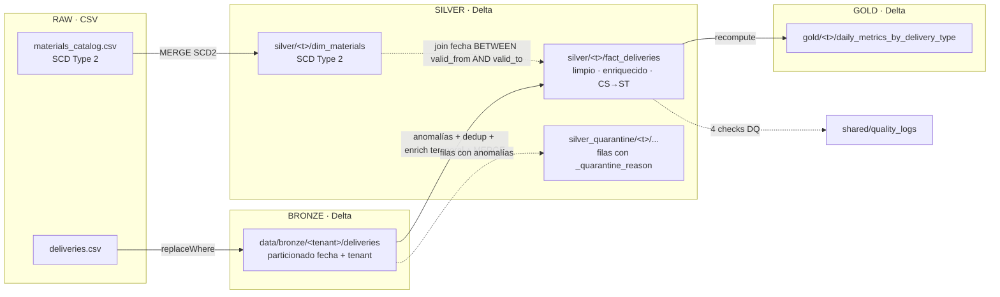

# SAAS Data Platform — Plataforma Multi-Tenant Medallion

> Implementación de la **Prueba Técnica Senior Data Engineer** para **Apex Digital / M5**.
> Pipeline multi-tenant **Bronze → Silver → Gold** sobre **PySpark + Delta Lake**, ejecutable localmente y compatible con Databricks (Runtime 15.x LTS).
>
> **Autor:** Daniel Santos · Lima, Perú · GitHub: [@Danzstorm](https://github.com/Danzstorm)
> **Repo:** [`github.com/Danzstorm/saas-data-platform`](https://github.com/Danzstorm/saas-data-platform)

---

## Tabla de contenidos

1. [¿Qué hace este proyecto?](#1-qué-hace-este-proyecto)
2. [Arquitectura en una vista](#2-arquitectura-en-una-vista)
3. [Estructura del repositorio](#3-estructura-del-repositorio)
4. [Pre-requisitos](#4-pre-requisitos)
5. [Instalación (Windows / PowerShell con uv)](#5-instalación-windows--powershell-con-uv)
6. [Cómo ejecutar el pipeline](#6-cómo-ejecutar-el-pipeline)
7. [Cómo correr tests y linter](#7-cómo-correr-tests-y-linter)
8. [Configuración (OmegaConf jerárquica)](#8-configuración-omegaconf-jerárquica)
9. [Onboarding de un tenant nuevo](#9-onboarding-de-un-tenant-nuevo)
10. [Despliegue en Databricks Free Edition (opcional)](#10-despliegue-en-databricks-free-edition-opcional)
11. [Decisiones técnicas y por qué cada una](#11-decisiones-técnicas-y-por-qué-cada-una)
12. [Qué dejé fuera y por qué](#12-qué-dejé-fuera-y-por-qué)
13. [Documentación relacionada](#13-documentación-relacionada)

---

## 1. ¿Qué hace este proyecto?

Procesa el dataset `global_mobility_data_entrega_productos.csv` (entregas de productos en 6 países / tenants: SV, HN, JM, EC, PE, GT) y lo combina con el catálogo SCD2 `materials_catalog.csv`, produciendo:

- **Bronze**: copia fiel del CSV en formato Delta, una partición por `(fecha_proceso, tenant_id)`.
- **Silver**: dos tablas por tenant:
  - `dim_materials` (SCD Type 2, MERGE por `(material, valid_from)`).
  - `fact_deliveries` limpia, normalizada (CS → ST, factor 20), con flags `is_routine_delivery` y `is_bonus_delivery`, enriquecida con la versión del catálogo válida a la fecha de la transacción (no la versión actual).
  - Anomalías derivadas a una tabla de **cuarentena** paralela con `_quarantine_reason`.
- **Gold**: agregaciones por (`tenant_id`, `fecha_proceso`, `tipo_entrega`) con `total_units`, `total_revenue`, `active_routes`, `active_transports`.
- **Quality logs**: tabla Delta compartida con el resultado de **4 validaciones** declarativas sobre Silver (esquema exacto definido en sec 5.9 de la prueba).

Todo es **idempotente** y **multi-tenant por configuración** (no por filtros hardcoded).

---

## 2. Arquitectura en una vista

> Para el detalle completo capa por capa, con diagramas Mermaid de SCD2, manejo de anomalías, idempotencia y CI, ver **[`docs/architecture.md`](docs/architecture.md)**.



> **Mapeo a Unity Catalog:** `data/<layer>/<tenant>/<table>/` ↔ `saas_<env>.<layer>_<tenant>.<table>`. La migración a Databricks es un cambio de configuración, no de código.

---

## 3. Estructura del repositorio

```
saas-data-platform/
├── README.md                    # este archivo
├── pyproject.toml               # uv + PySpark 3.5.3 + delta-spark 3.2.1 + omegaconf + typer + databricks-sdk
├── Makefile                     # atajos: install, lint, test, run-bronze/silver/gold/all, clean
├── .gitignore
├── .github/workflows/ci.yml     # lint (ruff) + tests (pytest) + validación YAML en push/PR
├── config/
│   ├── base.yaml                # defaults compartidos
│   ├── env/{dev,qa,main}.yaml   # overrides por ambiente
│   └── tenants/{sv,hn,jm,ec,pe,gt}.yaml   # overrides por tenant
├── data/                        # creado al ejecutar; no se versiona el contenido
│   ├── bronze/<tenant>/deliveries/fecha_proceso=YYYYMMDD/
│   ├── silver/<tenant>/{fact_deliveries,dim_materials}/
│   ├── gold/<tenant>/daily_metrics_by_delivery_type/
│   ├── silver_quarantine/<tenant>/<table>/
│   └── shared/quality_logs/
├── src/saas_pipeline/
│   ├── __init__.py
│   ├── cli.py                   # entrypoint Typer (`saas-pipeline run ...`)
│   ├── config.py                # loader OmegaConf jerárquico
│   ├── spark.py                 # factory SparkSession + Delta
│   ├── paths.py                 # composición de paths por capa/tenant/tabla
│   ├── schemas.py               # esquemas explícitos (deliveries + materials)
│   ├── utils.py                 # run_id, batch_id, date_range
│   ├── bronze.py                # Bronze: CSV → Delta con replaceWhere
│   ├── silver.py                # Silver: dim_materials SCD2 + fact_deliveries con anomalías
│   ├── gold.py                  # Gold: daily_metrics_by_delivery_type
│   └── quality.py               # 4 checks + persistencia en quality_logs
├── tests/
│   ├── conftest.py              # fixtures Spark con Delta (skip si no hay Java)
│   ├── test_config.py           # validación YAML + merge precedencia (13 tests)
│   ├── test_utils.py            # date_range, ids (5 tests)
│   ├── test_silver_transforms.py# unidades, anomalías, dedup, flags
│   ├── test_scd2_temporal_join.py # join temporal correcto (vs is_current)
│   └── test_quality.py          # 4 checks de calidad
├── docs/
│   ├── observations.md          # observaciones a la arquitectura (≥3 obs sustantivas)
│   ├── infra.md                 # Terraform: qué provisiona + snippet
│   └── onboarding-tenant.md     # guía paso a paso para tenant nuevo
├── mentoring/
│   ├── bad_code.py              # Anexo A literal
│   ├── good_code.py             # refactor genuinamente superior
│   └── code_review.md           # ≥4 observaciones + nota al junior
└── global_mobility_data_entrega_productos.csv   # input
└── materials_catalog.csv                         # input
```

---

## 4. Pre-requisitos

| Herramienta | Versión | Notas |
|---|---|---|
| **Python** | 3.11.x | `uv` lo gestiona automáticamente desde `pyproject.toml`. Databricks Runtime 15.x LTS también usa 3.11. |
| **Java JDK** | 17 (LTS) | Requerido por PySpark 3.5. Microsoft OpenJDK 17 o Temurin 17 funcionan. |
| **uv** | ≥ 0.4 | Gestor de entornos Python ultrarrápido. https://github.com/astral-sh/uv |
| **Git** | cualquiera reciente | Para clonar y comitear. |
| **GitHub CLI** (`gh`) | opcional | Para crear el repo y PRs desde la terminal. |

### Verificar pre-requisitos en PowerShell

```powershell
java -version       # debe imprimir "17.x.x"
uv --version        # debe imprimir "uv 0.4.x" o superior
python --version    # no es crítico — uv gestiona la versión de Python del proyecto
```

> Si Java no está instalado: `winget install Microsoft.OpenJDK.17` o `winget install EclipseAdoptium.Temurin.17.JDK`. Después reinicia la terminal para que `JAVA_HOME` se cargue.

---

## 5. Instalación (Windows / PowerShell con uv)

```powershell
# 1. Clona el repo
git clone https://github.com/Danzstorm/saas-data-platform.git
cd saas-data-platform

# 2. Crea el entorno virtual + instala dependencias (uv resuelve Python 3.11 automáticamente)
uv sync --extra dev

# 3. (Opcional) Activa el venv si vas a correr comandos manuales
.\.venv\Scripts\Activate.ps1
```

Esto instala (resumen):

- `pyspark==3.5.3` + `delta-spark==3.2.1` (motor + formato)
- `omegaconf>=2.3` (configuración jerárquica)
- `typer + rich` (CLI + output legible)
- `databricks-sdk>=0.30` (despliegue opcional)
- Dev: `pytest`, `ruff`, `pyyaml`

### En Linux / macOS / WSL

```bash
git clone https://github.com/Danzstorm/saas-data-platform.git
cd saas-data-platform
uv sync --extra dev
```

---

## 6. Cómo ejecutar el pipeline

Tres opciones equivalentes:

### Opción A — Comandos directos vía Typer

```powershell
# Pipeline completo (Bronze → Silver → Gold) para todos los tenants, ambiente dev, todo Q1-Q2 2025
uv run saas-pipeline run --layer all --tenant all --env dev `
    --start-date 2025-01-01 --end-date 2025-06-30
```

### Opción B — Capa por capa, un tenant específico

```powershell
# Sólo Bronze para Perú, primera semana de marzo
uv run saas-pipeline run --layer bronze --tenant pe --env dev `
    --start-date 2025-03-01 --end-date 2025-03-07

# Después Silver del mismo tenant/rango
uv run saas-pipeline run --layer silver --tenant pe --env dev `
    --start-date 2025-03-01 --end-date 2025-03-07

# Y finalmente Gold
uv run saas-pipeline run --layer gold --tenant pe --env dev `
    --start-date 2025-03-01 --end-date 2025-03-07
```

### Opción C — Makefile (atajos)

```powershell
# Todos los tenants, ambiente dev, rango completo
make run-all

# Un tenant específico
make run-all TENANT=pe ENV=dev START=2025-03-01 END=2025-03-31

# Sólo una capa
make run-bronze TENANT=sv
```

### Flags y opciones

| Flag | Descripción | Default |
|---|---|---|
| `--layer` | `bronze` / `silver` / `gold` / `all` | `all` |
| `--tenant` | código en minúscula (`sv`, `pe`, ...) o `all` | `all` |
| `--env` | `dev` / `qa` / `main` | `dev` |
| `--start-date` | `YYYY-MM-DD` (rango `fecha_proceso`) | requerido |
| `--end-date` | `YYYY-MM-DD` | requerido |
| `--fail-fast` | aborta toda la corrida ante el primer fallo de tenant | `false` |
| `--fail-on-critical` | aborta antes de Gold si falla algún check `critical` | `false` |

### Reproducibilidad / idempotencia

Cualquier ejecución se puede repetir con el mismo `--start-date / --end-date / --tenant` y el resultado es idéntico:

- **Bronze** usa `replaceWhere` por `(_tenant_id, fecha_proceso)`.
- **Silver fact_deliveries** usa `MERGE INTO` con clave de negocio.
- **Silver dim_materials** usa `MERGE INTO` con `(material, valid_from)` (SCD Type 2).
- **Gold** hace recompute por rango con `replaceWhere`.

---

## 7. Cómo correr tests y linter

```powershell
# Linter (ruff con regla PEP8)
uv run ruff check src tests
# o como atajo:
make lint

# Suite completa de tests
uv run pytest -v
# o:
make test

# Sólo los tests que NO requieren Spark (instantáneos, no requieren Java)
uv run pytest tests/test_config.py tests/test_utils.py -v
```

**Sobre los tests de Spark.** El fixture `spark` en `tests/conftest.py` levanta un `SparkSession` local con Delta extensions. Si Java no está disponible, los tests marcados con `@requires_spark` se **saltan automáticamente** con un mensaje claro. CI (GitHub Actions) instala Java 17 antes de correrlos.

---

## 8. Configuración (OmegaConf jerárquica)

Tres niveles de overrides, precedencia ascendente:

```
config/base.yaml                  # defaults
    ↓ overrides
config/env/<env>.yaml             # dev / qa / main
    ↓ overrides
config/tenants/<tenant>.yaml      # sv / hn / jm / ec / pe / gt
    ↓ overrides (CLI)
--start-date / --tenant / --env / --fail-on-critical (Typer)
```

### Parámetros relevantes

```yaml
# config/base.yaml (extracto)
paths:
  bronze: "data/bronze"
  silver: "data/silver"
  gold: "data/gold"
  quarantine_root: "data"
  quality_logs: "data/shared/quality_logs"

execution:
  start_date: "2025-01-01"
  end_date: "2025-06-30"
  tenant: all
  fail_fast: false

business:
  cs_to_st_factor: 20
  valid_delivery_types: [ZPRE, ZVE1, Z04, Z05]
  routine_types: [ZPRE, ZVE1]
  bonus_types: [Z04, Z05]

quality:
  fail_on_critical: false
```

### Por qué jerárquica

- **base** captura lo que NUNCA cambia (reglas de negocio: factor CS→ST, tipos válidos).
- **env** cambia rutas, paralelismo y políticas operativas (`fail_on_critical=true` sólo en `qa` y `main`).
- **tenants** captura lo particular de un país (timezone, currency, posibles overrides futuros de catálogo).
- **CLI** permite reproceso ad-hoc sin tocar archivos.

---

## 9. Onboarding de un tenant nuevo

Ver `docs/onboarding-tenant.md` para la guía paso a paso. Resumen:

1. Provisionar infraestructura (Terraform) — ver `docs/infra.md`.
2. Crear `config/tenants/<tenant>.yaml` en este repo.
3. Agregar el código a `tenants.known` en `config/base.yaml`.
4. PR contra `develop`.
5. Smoke run local: `make run-all TENANT=<tenant>`.
6. Smoke run en Databricks (DAB bundle).

> El proyecto no requiere refactor de código para agregar tenants — la configuración es lo único que cambia.

---

## 10. Despliegue en Databricks Free Edition (opcional)

> **Estado:** bonus opcional. El pipeline corre localmente sin Databricks. Esta sección describe el camino para llevarlo a Databricks Free Edition vía el MCP `databricks` ya configurado en `.mcp.json`.

### 10.1 Pre-requisitos

- Cuenta en [Databricks Free Edition](https://www.databricks.com/learn/free-edition).
- Databricks CLI configurado: `databricks configure --token` (usa el profile `DEFAULT` que apunta el MCP).
- Unity Catalog habilitado en el workspace (Free Edition lo trae por default).

### 10.2 Pasos resumidos

1. **Crear catálogo y schemas** (vía MCP o UI):

   ```sql
   CREATE CATALOG IF NOT EXISTS saas_dev;
   CREATE SCHEMA IF NOT EXISTS saas_dev.bronze_pe;
   CREATE SCHEMA IF NOT EXISTS saas_dev.silver_pe;
   CREATE SCHEMA IF NOT EXISTS saas_dev.gold_pe;
   CREATE SCHEMA IF NOT EXISTS saas_dev.shared;
   ```

2. **Subir los CSVs a un volumen** (`/Volumes/saas_dev/shared/raw/`).

3. **Empaquetar como DAB** (`databricks.yml` en la raíz, no incluido por defecto en esta entrega — se genera con `databricks bundle init`).

4. **Modificar `config/env/dev.yaml`** apuntando paths a `dbfs:/Volumes/...` o a tablas UC.

5. **Deploy y run**:

   ```bash
   databricks bundle deploy --target dev
   databricks bundle run saas_pipeline --target dev
   ```

> El código está escrito para no acoplarse al sistema de archivos local — todas las rutas vienen de `config/*.yaml`. Cambiar de filesystem a UC requiere reemplazar paths, no código.

---

## 11. Decisiones técnicas y por qué cada una

| Decisión | Por qué |
|---|---|
| **uv** en lugar de poetry / pip | Velocidad de resolución de dependencias, lockfile reproducible, manejo automático de Python 3.11. La prueba acepta "venv, poetry, uv u otro". |
| **PySpark 3.5.3 + delta-spark 3.2.1** | Versiones alineadas con Databricks Runtime 15.x LTS, requerido por la sección 3 del enunciado. |
| **Python 3.11 fijado** | Mismo runtime de DBR 15.x LTS. Garantiza que el código local se comporta igual que en Databricks. |
| **OmegaConf** para configuración | Nombrado explícitamente en sec 5.8 de la prueba. Soporta merge jerárquico nativo. |
| **Typer** para el CLI | API tipada, ayuda automática, menos boilerplate que argparse. |
| **Esquemas explícitos** (`schemas.py`) | Evita inferencia incorrecta del CSV (campos decimal con anomalías intencionales). Misma decisión que el refactor en `good_code.py`. |
| **Path-based isolation** + columna `_tenant_id` | Refleja exactamente el modelo de la sec 5.2. Permite migración 1:1 a Unity Catalog cambiando sólo paths. |
| **`replaceWhere`** en Bronze y Gold | Idempotencia por partición exigida en sec 5.5. |
| **`MERGE INTO`** en Silver fact y dim | Mismo motivo, exigido en sec 5.5. |
| **Join temporal `BETWEEN valid_from AND valid_to`** | Sec 5.7. El criterio negativo de evaluación explícitamente penaliza usar `is_current=true` en el join. Tenemos un test dedicado (`test_scd2_temporal_join.py`) que cubre este escenario. |
| **Cuarentena de orphan materials** | Sec 5.6 + criterio negativo: "Materiales no presentes silenciosamente en el join" baja la nota. Por eso el flujo es: left-join, marcar orphan, escribir a cuarentena, sólo entonces filtrar `_quarantine_reason IS NULL`. |
| **Partición sintética `fecha_proceso='__invalid__'`** en Bronze | Para que filas con fecha nula puedan llegar a Silver y ser cuarentenadas allí. Bronze necesita una columna no nula como partición. |
| **`_run_id` y `_batch_id`** | Trazabilidad cross-layer en `quality_logs`. Un `run_id` por invocación CLI, un `batch_id` por (run, tenant, layer). |
| **`fail_on_critical`** abortando antes de Gold | Sec 6.5. Implementado como una consulta a `quality_logs` filtrada por `run_id + tenant + severity=critical + check_passed=false`. |
| **4 checks** en lugar de 3 | Sec 6.5 pide ≥3. El 4° (`silver_dim_one_current_per_material`) cubre una invariante del modelo SCD2 que las demás no tocan. |
| **Tests separados de Spark vs. no-Spark** | Los no-Spark corren en < 100 ms y dan retroalimentación inmediata. Los de Spark se saltan si no hay Java (no rompen el flujo local). |
| **CI con `setup-java@v4`** | Garantiza que la suite Spark corre en GitHub Actions. La spec pide que el workflow sea funcional. |
| **Ruff** en lugar de flake8 | Más rápido, configurable por archivo (`mentoring/bad_code.py` excluido a propósito). La spec acepta "ruff, flake8 o equivalente". |
| **`mentoring/bad_code.py` no se toca** | Sec 8: el código del Anexo A se mantiene literal; el refactor va en `good_code.py`. |

---

## 12. Qué dejé fuera y por qué

Sec 9.1 de la prueba pide explícitamente esta sección. Decisiones de scope:

- **Tests de integración E2E ejecutándose contra el dataset completo en CI.** Los tests de transformaciones cubren la lógica; un test E2E necesitaría descargar el CSV, levantar un Spark con todo el dataset y validar shape final. Vale la pena en un MVP siguiente, no en éste.
- **Segunda tabla Gold** (bonus opcional). Prioricé profundidad en la primera (`daily_metrics_by_delivery_type`) y dedicar tiempo a observations.md y mentoring. Si hay tiempo en sustentación, se discute cuál tendría más valor (top materiales por tenant/mes es la candidata).
- **Auto Loader / streaming** (bonus opcional). El dataset es batch CSV; introducir streaming sería sobre-ingeniería para 3,100 filas.
- **Dashboard** (bonus opcional). Las tablas Gold son consultables con cualquier herramienta — Databricks SQL, Streamlit, Excel. No agrega valor de evaluación.
- **Pre-commit hooks** (bonus opcional). Ruff y pytest corren en CI; pre-commit es ergonomía local, no funcionalidad.
- **Terraform funcional (`terraform plan` contra cuenta real)**. Sec 7.2 explícitamente dice que basta con el snippet; uno funcional requiere credenciales que no tengo y multiplica la complejidad.
- **Mock de Unity Catalog en tests**. El código está preparado para UC (paths derivados de config), pero las pruebas usan filesystem local para no depender de un workspace.
- **Caché / optimizaciones de performance**. PySpark local sobre 3k filas no las necesita. En Databricks, `OPTIMIZE` y `VACUUM` van como Jobs separados (referenciado en `docs/observations.md`).
- **Logging estructurado JSON.** Hoy usamos Rich (colores) en local + `print` con métricas. En Databricks productivo, log4j+JSON correspondería; hoy no aporta para evaluación.

---

## 13. Documentación relacionada

| Archivo | Contenido |
|---|---|
| [`docs/architecture.md`](docs/architecture.md) | **Vista detallada** del pipeline con 15 diagramas Mermaid: flujo end-to-end, capa por capa, SCD2 temporal, manejo de anomalías, idempotencia, CI. |
| [`docs/observations.md`](docs/observations.md) | **Obligatorio** por sec 9.2. 6 observaciones sustantivas sobre la arquitectura (mínimo eran 3). |
| [`docs/infra.md`](docs/infra.md) | Terraform: qué provisiona + snippet del módulo principal (sec 7.2). |
| [`docs/onboarding-tenant.md`](docs/onboarding-tenant.md) | Guía paso a paso para agregar un tenant nuevo. |
| [`mentoring/code_review.md`](mentoring/code_review.md) | Code review del Anexo A (`bad_code.py`) — 6 observaciones + nota al junior. |
| [`mentoring/good_code.py`](mentoring/good_code.py) | Refactor genuinamente superior del Anexo A. |

---

## Convención de idiomas

| Elemento | Idioma | Razón |
|---|---|---|
| Código (variables, funciones) | inglés | Convención común en Data Engineering, requerido por sec 12. |
| Documentación (este README, observations, infra, onboarding) | español | Lengua materna del autor y del equipo evaluador. |
| Comentarios en código | mixto consistente (mayormente español en lógica de negocio, inglés en docstrings de API) | Aceptado por sec 12. |
| Commits | inglés | Estándar de la industria; uniforme con `gh` / GitHub. |

---

## Contacto

**Daniel Santos** · Lima, Perú · [daniel.santos.emprende@gmail.com](mailto:daniel.santos.emprende@gmail.com) · [@Danzstorm](https://github.com/Danzstorm)
