# Arquitectura del pipeline

> Este documento describe la arquitectura del pipeline SAAS multi-tenant **parte por parte**, con diagramas Mermaid que GitHub renderiza nativamente. Es la referencia visual del README — léelo de arriba a abajo para entender cómo viajan los datos.

---

## 1. Flujo end-to-end (vista 30 000 pies)

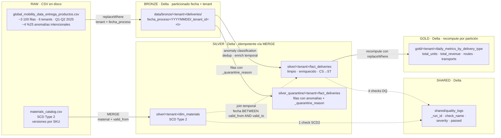

---

## 2. Capa por capa — qué hace cada `.py`

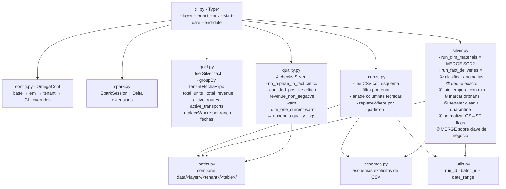

---

## 3. Detalle Bronze — qué hace una corrida

```mermaid
sequenceDiagram
    autonumber
    participant CLI
    participant Bronze as bronze.py
    participant Spark
    participant Delta as data/bronze/&lt;tenant&gt;/deliveries

    CLI->>Bronze: run(tenant='pe', start='2025-01-01', end='2025-06-30')
    Bronze->>Spark: read.csv(raw_deliveries, schema=RAW_DELIVERIES_SCHEMA)
    Note over Spark: Esquema explícito — sin inferencia
    Bronze->>Spark: filter(pais.upper() == 'PE')
    Bronze->>Spark: filter(fecha in range OR fecha is invalid)
    Note over Bronze,Spark: Las filas con fecha nula van a la partición sintética __invalid__<br/>para que Silver pueda cuarentenarlas
    Bronze->>Spark: withColumn(_tenant_id='pe')
    Bronze->>Spark: withColumn(_ingestion_timestamp, _source_file, _batch_id)
    Bronze->>Delta: write.delta(replaceWhere='_tenant_id=pe AND fecha BETWEEN ...')
    Note over Delta: Idempotente: una reejecución del mismo rango sobrescribe esa ventana<br/>sin duplicar y sin tocar particiones fuera del rango
```

---

## 4. Detalle Silver — el corazón del pipeline

```mermaid
flowchart TB
    B[Bronze<br/>data/bronze/&lt;t&gt;/deliveries<br/>filas crudas con columnas técnicas]

    B --> CLA[_classify_anomalies<br/>añade _quarantine_reason:<br/>· null/__invalid__ fecha<br/>· cantidad null o ≤ 0<br/>· precio null<br/>· tipo_entrega no en valid set → '__discard__'<br/>· null/None = fila limpia]

    CLA --> DED[_dedup_exact<br/>dropDuplicates sobre 9 cols originales<br/>conserva una copia por fila idéntica]

    DED --> JOIN[_temporal_join_materials<br/>LEFT join con silver/&lt;t&gt;/dim_materials<br/>fact.fecha_proceso BETWEEN dim.valid_from AND dim.valid_to<br/>NO usa is_current ←]

    JOIN --> ORPH[_flag_orphans<br/>si row es 'clean' Y dim.descripcion IS NULL<br/>→ _quarantine_reason = 'orphan_material']

    ORPH --> SPLIT{¿_quarantine_reason?}

    SPLIT -->|NULL = clean| NORM[_normalize_units<br/>CS × 20 = ST<br/>añade cantidad_st]
    SPLIT -->|'__discard__'| DISCARD[contar y descartar<br/>no se persiste]
    SPLIT -->|cualquier otra| QUAR[_write_quarantine<br/>OVERWRITE por tenant_id<br/>silver_quarantine/&lt;t&gt;/fact_deliveries]

    NORM --> FLAGS[_add_flags<br/>is_routine_delivery in {ZPRE,ZVE1}<br/>is_bonus_delivery in {Z04,Z05}]

    FLAGS --> TECH[añade columnas técnicas:<br/>_silver_run_id<br/>_silver_batch_id<br/>_silver_ingestion_timestamp]

    TECH --> MERGE[_write_fact<br/>MERGE INTO silver/&lt;t&gt;/fact_deliveries<br/>ON tenant + fecha + transporte + ruta + material + tipo_entrega]

    MERGE --> DONE[Silver fact_deliveries listo<br/>~89%25 de las filas raw para tenants normales]
```

### ¿Por qué este orden?

1. **Clasificar antes de deduplicar.** Si deduplicamos primero, perdemos info de cuántos duplicados había.
2. **Dedup antes del join.** Hace el join más barato (menos filas) y el resultado es el mismo (los duplicados son idénticos en columnas).
3. **Join antes de marcar orphans.** No podemos saber qué es orphan hasta que el left join no encuentra match.
4. **Marcar orphans antes de filtrar limpios.** Una fila con material huérfano pero todo lo demás bien debe ir a cuarentena, no a Silver.
5. **Normalizar y flagear DESPUÉS de filtrar limpios.** No tiene sentido normalizar filas que vamos a tirar.
6. **MERGE al final.** Sólo lo limpio entra a la tabla autoritativa.

---

## 5. SCD Type 2 — el join temporal explicado visualmente

El cat catálogo tiene SKUs con historia. Ejemplo real: `AA004003` (Cola Regular 600 ml):

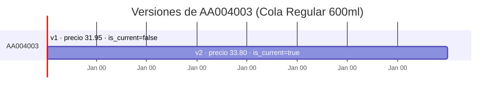

Una transacción del **2025-03-01** debe matchear **v1** (precio 31.95). Una del **2025-05-01** debe matchear **v2** (33.80). Si usáramos `is_current=true`, **TODAS** las transacciones históricas matchearían la versión actual y el revenue histórico saldría inflado.

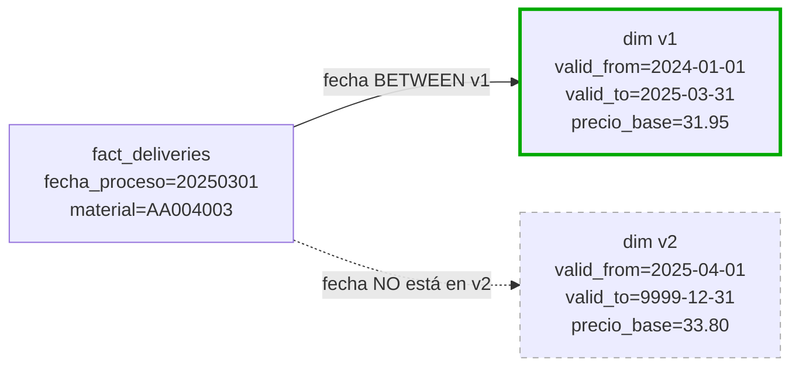

Por eso el join es **literalmente**:

```sql
fact.fecha_proceso BETWEEN dim.valid_from AND dim.valid_to
```

y **NO**:

```sql
dim.is_current = true   -- ¡incorrecto! mata el histórico
```

El test `tests/test_scd2_temporal_join.py:test_temporal_join_picks_correct_version` cubre exactamente este escenario.

---

## 6. Manejo de anomalías — la regla por la regla

| Tipo de anomalía | Acción | Justificación de negocio |
|---|---|---|
| `fecha_proceso` null o inválida | **Cuarentena** | Sin fecha no se puede particionar ni atribuir. No se descarta porque puede haber error de origen recuperable. |
| `cantidad` null, negativa o cero | **Cuarentena** | Posible error de feed. Una cantidad cero en una entrega es sospechosa, no obvia. |
| `precio` null | **Cuarentena** | Sin precio el revenue no es calculable. Por consistencia con cantidad, no se asume cero. |
| `material` no en el catálogo | **Cuarentena** | Romper integridad referencial debe ser visible. Es el bug más fácil de pasar por alto (left-join silencioso = filas sin enrich). |
| `tipo_entrega` fuera de {ZPRE,ZVE1,Z04,Z05} | **Descarte** | Regla de negocio: COBR (cobranza), Z99 (lo que sea) no son entregas, no entran al modelo analítico. Sólo se cuentan. |
| Duplicado exacto | **Deduplicar** | El feed envía la misma fila dos veces. No es un error visible — sólo nos quedamos con una copia. |

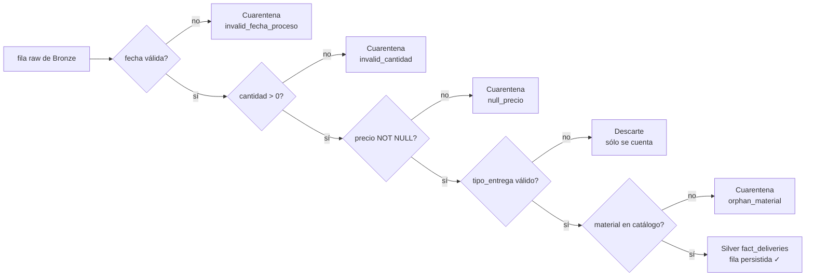

---

## 7. Idempotencia capa por capa

| Capa | Estrategia | Qué pasa si re-corro el mismo rango |
|---|---|---|
| Bronze | `replaceWhere` por `_tenant_id` + `fecha_proceso` rango | Sólo se reescribe esa ventana. Particiones fuera del rango quedan intactas. |
| Silver `dim_materials` | `MERGE INTO` por `(material, valid_from)` | Las versiones existentes se actualizan si cambiaron sus atributos. Nuevas versiones se insertan. |
| Silver `fact_deliveries` | `MERGE INTO` por clave de negocio compuesta | Filas existentes se actualizan, nuevas se insertan. |
| Silver `quarantine` | `overwrite` con `replaceWhere` por `_tenant_id` | Toda la cuarentena del tenant se reconstruye en cada run (es reproducible desde raw). |
| Gold | `overwrite` con `replaceWhere` por rango de `fecha_proceso` | Se recomputan sólo las particiones del rango. |
| Quality logs | `append` | Histórico inmutable — cada run añade una fila por check. (Mejora propuesta en `observations.md`: particionar por `executed_date`.) |

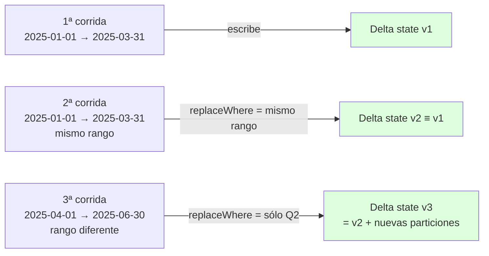

---

## 8. Quality logs — el contrato del schema

Tabla Delta compartida en `data/shared/quality_logs/` (en Databricks: `<env>.shared.quality_logs`). Una fila por (run × tenant × check).

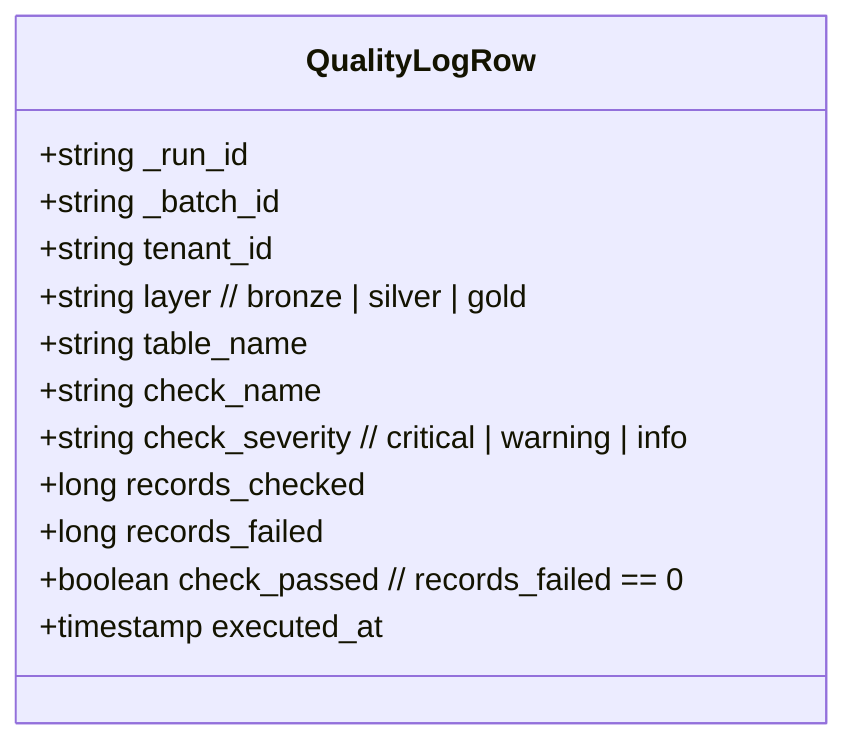

**Por qué este esquema:**

- `_run_id` permite **cross-layer trace**: un solo `run_id` cubre Bronze→Silver→Gold de un tenant.
- `_batch_id` es más fino: uno por `(run, tenant, layer)`.
- `tenant_id + layer + table_name` localizan **qué dato** se chequeó.
- `severity` clasifica la urgencia: `critical` puede abortar Gold (`--fail-on-critical`).
- `records_checked / records_failed` dan **magnitud** del problema, no sólo pass/fail.
- `executed_at` permite filtrar histórico y construir vistas agregadas.

---

## 9. Configuración jerárquica — qué wins qué

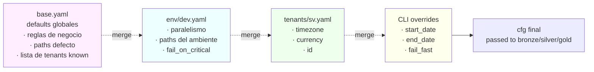

Precedencia: derecha gana. Si en `base.yaml` `shuffle_partitions=8` y en `env/qa.yaml` es `32`, en QA queda `32`. Si encima la CLI pasara un override, ganaría la CLI.

---

## 10. Multi-tenant — un solo código, N tenants

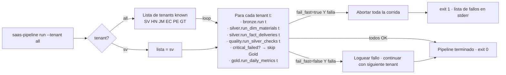

El **aislamiento es por path**: cada tenant escribe en `data/<layer>/<tenant>/`. Los códigos vienen en mayúscula del CSV (`SV`, `PE`) y se normalizan a minúscula al entrar a Bronze (sec 5.3 de la spec).

---

## 11. Mapeo local → Databricks (Unity Catalog)

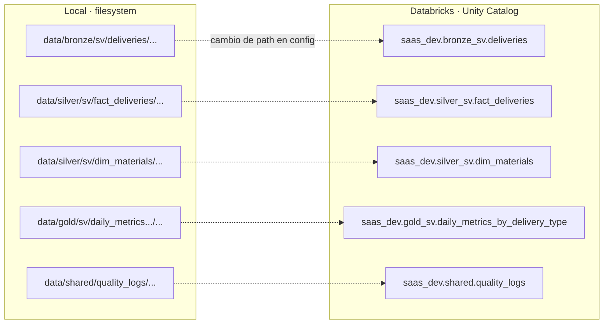

**Punto clave:** la migración a Databricks NO requiere cambios de código. Sólo:
1. Cambiar los `paths.*` en `config/env/main.yaml` a paths `abfss://` o `dbfs:/Volumes/...`.
2. En lugar de `.save(path)`, usar `.saveAsTable(table_uc_name)` (cambio en `paths.py`).
3. Hacer deploy vía DAB (`databricks bundle deploy`).

---

## 12. Tests — qué cubre cada uno

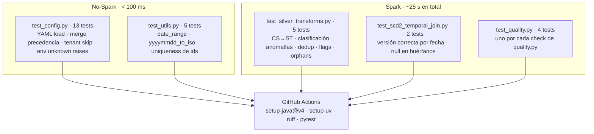

**29 tests total · todos verdes en local · todos corren en CI.**

---

## 13. ¿Y la mentoría?

`mentoring/bad_code.py` es el código del Anexo A literal. `mentoring/good_code.py` es un refactor:

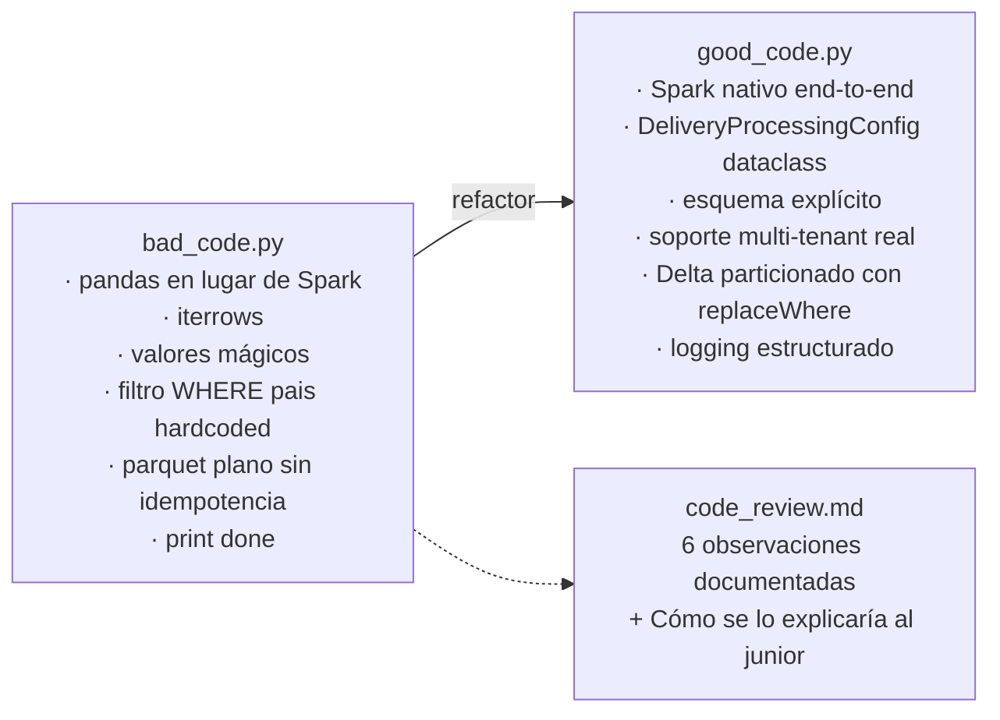

Las 6 observaciones cubren los criterios negativos del eval explícitamente.

---

## 14. CI / CD

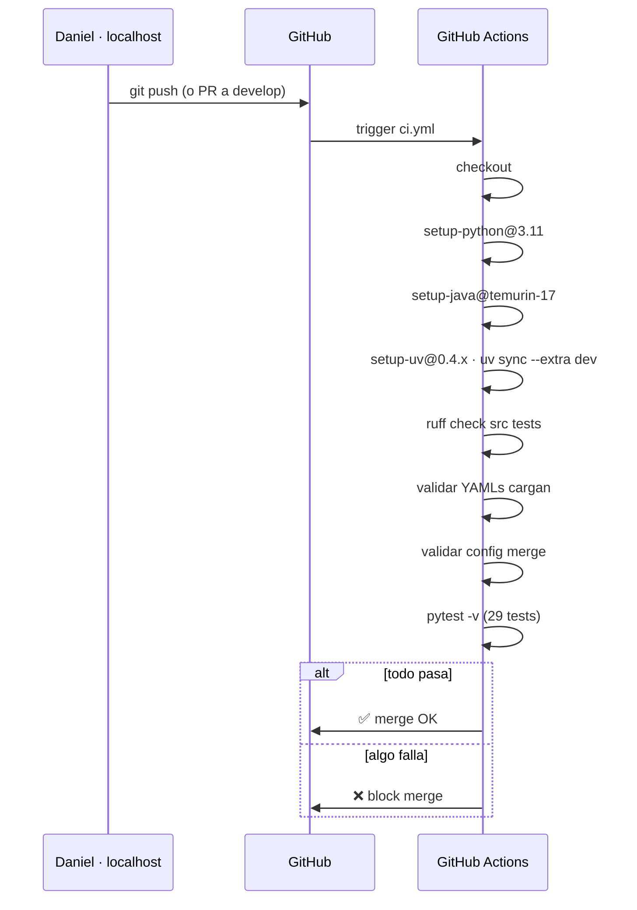

---

## 15. Onboarding de un tenant nuevo (resumen visual)

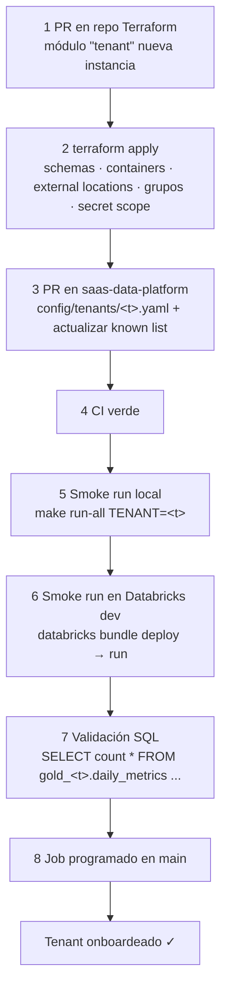

Detalle completo en [`onboarding-tenant.md`](onboarding-tenant.md).
