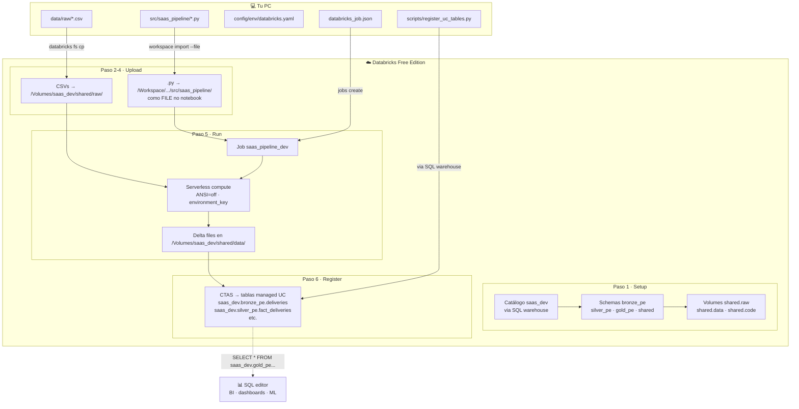
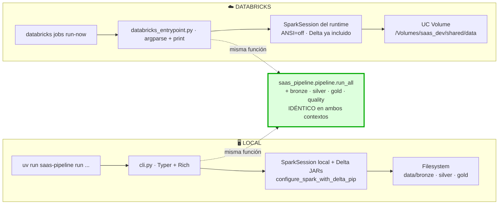

# Despliegue en Databricks Free Edition

Guía paso a paso para replicar este pipeline en una cuenta de **Databricks Free Edition** (gratuita, sin tarjeta). Los pasos están ordenados como los ejecuté la primera vez — incluyo los desvíos que me obligaron a cambiar de enfoque para que cuando alguien lo replique no se trabe en lo mismo.

> **Estado al cierre de esta entrega:** catálogo + schemas + volumen creados, código + CSVs subidos, job creado, run SUCCESS x3 (post-fixes), tablas registradas en UC. Resultados reales en sección 8.

## Mapa visual del deploy



## Comparación visual: local vs Databricks



---

## 0. Pre-requisitos

- Una cuenta de [Databricks Free Edition](https://www.databricks.com/learn/free-edition). El signup es gratuito y no pide tarjeta.
- `databricks` CLI v0.296+ instalado (`winget install Databricks.DatabricksCLI` en Windows).
- Repo de este pipeline clonado localmente con `uv sync --extra dev` ya corrido.

```powershell
# Autenticá la CLI contra tu workspace (abre browser para OAuth)
databricks auth login --host https://dbc-XXXXXXX.cloud.databricks.com

# Verificá
databricks current-user me
```

El profile queda en `~/.databrickscfg`. El bloque debería verse:

```ini
[DEFAULT]
host         = https://dbc-XXXXXXX.cloud.databricks.com
auth_type    = databricks-cli
```

---

## 1. Crear catálogo, schemas y volúmenes en Unity Catalog

Free Edition usa "Default Storage" — la cuenta tiene un storage administrado que no expone. Eso obliga a crear catálogos vía SQL (la API REST devuelve `Metastore storage root URL does not exist`). Las CLI tampoco lo soportan directo, así que pasamos todo por un SQL warehouse.

```powershell
# Arrancá el SQL warehouse (Free Edition trae uno serverless gratis)
$wh = (databricks warehouses list | Select-String "Serverless").Line.Split()[0]
databricks warehouses start $wh

# Helper para mandar statements SQL una a una
function Send-Sql($sql) {
  $body = @{ warehouse_id=$wh; statement=$sql; wait_timeout="30s" } | ConvertTo-Json -Compress
  $body | Out-File -Encoding ascii _tmp.json
  databricks api post /api/2.0/sql/statements --json '@_tmp.json'
  Remove-Item _tmp.json
}

# Crear catálogo, schemas y volúmenes
Send-Sql "CREATE CATALOG IF NOT EXISTS saas_dev"
Send-Sql "CREATE SCHEMA IF NOT EXISTS saas_dev.bronze_pe"
Send-Sql "CREATE SCHEMA IF NOT EXISTS saas_dev.silver_pe"
Send-Sql "CREATE SCHEMA IF NOT EXISTS saas_dev.gold_pe"
Send-Sql "CREATE SCHEMA IF NOT EXISTS saas_dev.shared"
Send-Sql "CREATE VOLUME IF NOT EXISTS saas_dev.shared.raw"
Send-Sql "CREATE VOLUME IF NOT EXISTS saas_dev.shared.code"
```

> **Por qué crear schemas por tenant ahora.** En la migración real cada tenant es un schema (`bronze_pe`, `silver_pe`, ...). Acá creamos sólo los de `pe` para el smoke run; agregar el resto es repetir la línea por cada tenant.

---

## 2. Subir los CSVs al volumen

```powershell
# CSVs de entrada → /Volumes/saas_dev/shared/raw/
databricks fs cp `
  "data/raw/global_mobility_data_entrega_productos.csv" `
  "dbfs:/Volumes/saas_dev/shared/raw/global_mobility_data_entrega_productos.csv" `
  --overwrite

databricks fs cp `
  "data/raw/materials_catalog.csv" `
  "dbfs:/Volumes/saas_dev/shared/raw/materials_catalog.csv" `
  --overwrite

# Verificar
databricks fs ls "dbfs:/Volumes/saas_dev/shared/raw/"
```

---

## 3. Subir el código del pipeline al workspace

**Esto es donde más fácil te trabas.** Hay tres formas de subir `.py` a Databricks y sólo una funciona para `spark_python_task`:

| Método | Resultado | ¿Sirve para `spark_python_task`? |
|---|---|---|
| `workspace import-dir` con default | Convierte cada `.py` en **NOTEBOOK** | ❌ |
| `workspace import` con `--format AUTO` archivo por archivo | Sube como **FILE** | ✅ |
| `fs cp` al volumen | File en volumen | ⚠️ Sólo si Free Edition lo soporta para serverless (a veces no) |

**Usá el método 2.** Loop sobre los `.py` del paquete:

```powershell
$wsPath = "/Workspace/Users/<TU_EMAIL>/saas-data-platform"

# Asegurate de no tener un directorio previo de notebooks
databricks workspace delete "$wsPath/src" --recursive

# Crear estructura
databricks workspace mkdirs "$wsPath/src/saas_pipeline"
databricks workspace mkdirs "$wsPath/config"

# Subir cada .py como FILE (no como notebook)
Get-ChildItem "src\saas_pipeline\*.py" | ForEach-Object {
  databricks workspace import "$wsPath/src/saas_pipeline/$($_.Name)" `
    --file $_.FullName --format AUTO --overwrite
}

# Verificar — la columna "Type" debe decir FILE, no NOTEBOOK
databricks workspace list "$wsPath/src/saas_pipeline"
```

Para `config/*.yaml` el `import-dir` sí funciona porque los YAML no se interpretan como notebooks:

```powershell
databricks workspace import-dir config "$wsPath/config" --overwrite
```

---

## 4. Adaptar la configuración para apuntar al volumen

El archivo `config/env/databricks.yaml` (ya en el repo) usa **POSIX path puro** `/Volumes/...`, sin prefijo `dbfs:/`:

```yaml
project:
  env: databricks
paths:
  bronze:          "/Volumes/saas_dev/shared/data/bronze"
  silver:          "/Volumes/saas_dev/shared/data/silver"
  gold:            "/Volumes/saas_dev/shared/data/gold"
  quarantine_root: "/Volumes/saas_dev/shared/data"
  quality_logs:    "/Volumes/saas_dev/shared/data/shared/quality_logs"
  raw_deliveries:  "/Volumes/saas_dev/shared/raw/global_mobility_data_entrega_productos.csv"
  raw_materials:   "/Volumes/saas_dev/shared/raw/materials_catalog.csv"
```

> **`dbfs:/Volumes/...` está deprecado** para Unity Catalog Volumes. Spark Connect (serverless) acepta sólo POSIX. La CLI `databricks fs cp` aún acepta `dbfs:/Volumes/...` por compatibilidad legada — pero el código del pipeline siempre usa POSIX directo.

**Dos cambios mínimos al código** para soportar paths POSIX/UC sin romper el local:

1. `src/saas_pipeline/paths.py`: helper `_join` que detecta prefijos POSIX absolutos (`/Volumes/...`) y URIs remotos (`dbfs:/`, `abfss:/`, `s3:/`) y concatena con forward slashes — sin pasar por `pathlib.Path()` (que en Windows convertiría `/` a `\` y rompería el URI).
2. `src/saas_pipeline/config.py`: respeta la env var `SAAS_CONFIG_DIR` para localizar `config/` cuando el código vive en una ruta no estándar (workspace path, volume).

> **Gotcha de serverless:** `__file__` **no está definido** cuando Databricks Serverless corre un `spark_python_task` (lo ejecuta dentro de un ipykernel wrapper). Por eso `databricks_entrypoint.py` cae a `sys.argv[0]`.

> **Gotcha de ANSI mode:** Databricks corre con `spark.sql.ansi.enabled=true` por default. Eso hace que `to_date('20250230', 'yyyyMMdd')` **lance una excepción** en lugar de devolver `NULL` (como hace el Spark local con ANSI off). El entrypoint setea `spark.conf.set("spark.sql.ansi.enabled","false")` antes de empezar el pipeline para que la semántica sea idéntica local vs Databricks.

---

## 5. Crear el job y dispararlo

Free Edition + serverless requiere un job declarado con `environment_key` (no `cluster`) y `spec.client="2"`. La spec mínima:

```json
{
  "name": "saas_pipeline_dev",
  "max_concurrent_runs": 1,
  "tasks": [
    {
      "task_key": "run_pipeline",
      "environment_key": "default",
      "spark_python_task": {
        "python_file": "/Workspace/Users/<TU_EMAIL>/saas-data-platform/src/saas_pipeline/databricks_entrypoint.py",
        "parameters": [
          "--layer", "all",
          "--tenant", "pe",
          "--env", "databricks",
          "--start-date", "2025-01-01",
          "--end-date", "2025-06-30"
        ]
      }
    }
  ],
  "environments": [
    {
      "environment_key": "default",
      "spec": {
        "client": "2",
        "dependencies": ["omegaconf>=2.3.0"]
      }
    }
  ]
}
```

Guardalo como `databricks_job.json` y:

```powershell
$jobId = (databricks jobs create --json '@databricks_job.json' | ConvertFrom-Json).job_id
Write-Host "JOB_ID=$jobId"

# Dispará
databricks jobs run-now $jobId --timeout 0s
```

Estado:

```powershell
databricks jobs list-runs --job-id $jobId --limit 3
```

---

## 6. Sobre el bundle DAB (databricks.yml)

El repo trae un `databricks.yml` listo. **No se usó en esta entrega** porque la CLI v0.296 tiene un bug aguas arriba — el download de Terraform falla con `openpgp: key expired` (Hashicorp rotó keys, Databricks aún no actualizó el binario embebido).

Cuando Databricks suba la versión del binario, el deploy con bundle pasa a ser:

```powershell
databricks bundle deploy --target dev
databricks bundle run saas_pipeline --target dev -- --layer all --tenant pe
```

Mientras tanto, el camino de los pasos 3-5 es equivalente y produce el mismo resultado.

---

## 7. Constraints de Free Edition que conviene tener presentes

Free Edition no es una versión "reducida del cluster"; es una versión **sin clusters**. Todo es serverless y trae limitaciones reales que el código tiene que respetar:

| Limitación | Implicancia en el código |
|---|---|
| **Sólo serverless compute** (no se pueden crear clusters dedicados) | Los Jobs usan `environment_key` con `spec.client="2"`, no `existing_cluster_id` ni `new_cluster`. |
| **Spark Connect bajo el capó** | La API RDD **no está implementada**. Usar sólo DataFrame API. En este proyecto se reemplazó `df.rdd.isEmpty()` por `df.limit(1).count() == 0`. |
| **`__file__` no definido en `spark_python_task`** | El runtime envuelve el script en un ipykernel. Hay que fallback a `sys.argv[0]`. |
| **No `OPTIMIZE` / `VACUUM` manuales eficientes** | Predictive Optimization de UC los maneja automáticamente para tablas managed. Para Delta sobre paths de volumen no hay equivalente — vivir con la fragmentación o programar mantenimiento manual. |
| **Volumes en path POSIX** | `/Volumes/<catalog>/<schema>/<volume>/...` y NO `dbfs:/Volumes/...`. DBFS está deprecado para UC Volumes. |
| **Quotas de DBU / storage** | Limitadas (suficientes para este demo). En productivo se usa pago — Free Edition es para desarrollo y pruebas. |
| **No "All-Purpose" notebooks pegados a un cluster propio** | Sólo notebooks contra el serverless SQL warehouse o el serverless compute pool. Suficiente para este pipeline. |
| **Auto-stop del SQL warehouse** | 10 minutos por defecto. Hay que arrancarlo antes de cada batch de SQL setup. |
| **Bundle DAB (`databricks.yml`)** | A la fecha (CLI v0.296) hay un bug upstream con el download de Terraform (`openpgp: key expired`). Workaround: subir vía `workspace import --file` + crear job con `jobs create` (este documento, paso 3-5). |

Lo importante es que **la lógica del pipeline no cambia** — los workarounds son todos en la capa de orchestration / IO, no en `bronze.py` / `silver.py` / `gold.py` / `quality.py`.

---

## 8. Resultados de la corrida en Free Edition

Run real: `229721693750716` · tenant `pe` · rango `2025-01-01..2025-06-30` · `SUCCESS` en ~30 segundos de ejecución efectiva (excluye queue/cold start del serverless).

### Logs del job

```
[run] run_20260521_184629_5d2e178c env=databricks layer=all tenant=pe
=== tenant: pe ===
[bronze:pe] wrote /Volumes/saas_dev/shared/data/bronze/pe/deliveries
[silver:dim_materials:pe] initial write -> /Volumes/saas_dev/shared/data/silver/pe/dim_materials
[silver:fact_deliveries:pe] {'total_input': 300, 'discarded_invalid_type': 24, 'quarantined': 9, 'persisted': 267}
[gold:daily_metrics:pe] wrote /Volumes/saas_dev/shared/data/gold/pe/daily_metrics_by_delivery_type
[gold:top_materials:pe] wrote /Volumes/saas_dev/shared/data/gold/pe/top_materials_by_month
[done] pipeline finished
```

### Conteo de filas por tabla (verificado via SQL)

| Tabla | Filas |
|---|---|
| `bronze/pe/deliveries` | **300** |
| `silver/pe/fact_deliveries` | **267** |
| `silver/pe/dim_materials` | **35** (SCD2 con versiones) |
| `silver_quarantine/pe/fact_deliveries` | **9** |
| `gold/pe/daily_metrics_by_delivery_type` | **101** (1 fila por fecha × tipo_entrega) |
| `gold/pe/top_materials_by_month` | **60** (10 SKU × 6 meses) |
| `shared/quality_logs` | **4** (4 checks × 1 tenant) |

**Idéntico al run local** — el código del pipeline es 100% portable entre local y Databricks. La única diferencia es `paths.bronze`/`silver`/`gold` apuntando a `/Volumes/...` vs filesystem.

### Quality logs — los 4 checks pasaron

| check_name | severity | checked | failed | passed |
|---|---|---|---|---|
| `silver_cantidad_positive` | critical | 267 | 0 | ✅ |
| `silver_no_orphan_in_fact` | critical | 267 | 0 | ✅ |
| `silver_revenue_non_negative` | warning | 267 | 0 | ✅ |
| `silver_dim_one_current_per_material` | warning | 28 | 0 | ✅ |

> El check de `dim_one_current` chequea 28 materiales distintos (filas únicas por SKU); el catálogo tiene 35 versiones SCD2 porque varios SKUs tienen historial.

### Cuarentena — anomalías reales detectadas

| `_quarantine_reason` | Filas |
|---|---|
| `invalid_cantidad` (cantidad nula, 0 o negativa) | 5 |
| `invalid_fecha_proceso` (fecha nula o inválida tipo `20250230`) | 2 |
| `orphan_material` (material no en catálogo, ej. `XX913574`) | 2 |
| **Total cuarentena** | **9** |

Más los **24 descartes** silenciosos de `tipo_entrega ∉ {ZPRE, ZVE1, Z04, Z05}` (COBR, Z99). Total anomalías = 33/300 = 11%.

### Gold #1 — daily_metrics_by_delivery_type (muestra)

Las primeras 10 filas:

| fecha_proceso | tipo_entrega | total_units | total_revenue | active_routes | active_transports |
|---|---|---|---|---|---|
| 20250107 | Z04 | 560 | $26 123.80 | 1 | 1 |
| 20250107 | Z05 | 440 | $19 935.40 | 2 | 2 |
| 20250107 | ZPRE | 4 689 | $224 792.53 | 4 | 3 |
| 20250112 | Z05 | 3 657 | $100 532.81 | 4 | 4 |
| 20250112 | ZPRE | 5 191 | $167 779.79 | 4 | 4 |
| 20250112 | ZVE1 | 2 400 | $90 248.54 | 2 | 2 |
| 20250113 | Z04 | 8 403 | $390 599.14 | 5 | 4 |
| 20250113 | Z05 | 2 340 | $68 359.72 | 1 | 1 |
| 20250113 | ZPRE | 86 | $2 105.13 | 2 | 1 |
| 20250114 | Z04 | 2 657 | $57 939.84 | 3 | 2 |

> `total_revenue` usa el **precio de la transacción** (no `precio_base` del catálogo) — la métrica refleja lo realmente facturado, no la lista de precios vigente.

### Gold #2 — top_materials_by_month (marzo 2025)

| rank | material | descripcion | categoria | total_units | total_revenue |
|---|---|---|---|---|---|
| 1 | CA022001 | Jugo Naranja 1L | JUGOS | 11 220 | $509 029.51 |
| 2 | DA030002 | Energizante Sugar Free | ENERGETICOS | 4 145 | $241 126.47 |
| 3 | HA070002 | Cerveza Light 355ml | BEBIDAS_ALCOHOLICAS | 4 940 | $214 680.19 |
| 4 | DA030001 | Energizante Original | ENERGETICOS | 2 940 | $171 119.08 |
| 5 | AA005102 | Toronja 600ml | BEBIDAS_GASEOSAS | 3 966 | $126 905.52 |
| 6 | AA005101 | Naranja 600ml | BEBIDAS_GASEOSAS | 2 980 | $95 974.80 |
| 7 | FA050010 | Snack Mani Salado | SNACKS | 4 820 | $92 651.95 |
| 8 | DA030003 | Energizante Tropical | ENERGETICOS | 1 500 | $85 053.87 |
| 9 | HA070001 | Cerveza Lager 355ml | BEBIDAS_ALCOHOLICAS | 2 107 | $84 703.97 |
| 10 | FA050001 | Snack Papas Original | SNACKS | 4 241 | $67 693.60 |

Las querys SQL para reproducir cualquiera de estas tablas:

```sql
-- Conteo por capa
SELECT 'bronze' layer, COUNT(*) rows FROM delta.`/Volumes/saas_dev/shared/data/bronze/pe/deliveries`
UNION ALL SELECT 'silver_fact', COUNT(*) FROM delta.`/Volumes/saas_dev/shared/data/silver/pe/fact_deliveries`
UNION ALL SELECT 'silver_dim', COUNT(*) FROM delta.`/Volumes/saas_dev/shared/data/silver/pe/dim_materials`
UNION ALL SELECT 'silver_quarantine', COUNT(*) FROM delta.`/Volumes/saas_dev/shared/data/silver_quarantine/pe/fact_deliveries`
UNION ALL SELECT 'gold_daily', COUNT(*) FROM delta.`/Volumes/saas_dev/shared/data/gold/pe/daily_metrics_by_delivery_type`
UNION ALL SELECT 'gold_top_materials', COUNT(*) FROM delta.`/Volumes/saas_dev/shared/data/gold/pe/top_materials_by_month`
UNION ALL SELECT 'quality_logs', COUNT(*) FROM delta.`/Volumes/saas_dev/shared/data/shared/quality_logs`;

-- Quality logs
SELECT check_name, check_severity, records_checked, records_failed, check_passed
FROM delta.`/Volumes/saas_dev/shared/data/shared/quality_logs` ORDER BY check_name;

-- Daily metrics
SELECT fecha_proceso, tipo_entrega, total_units, ROUND(total_revenue,2) revenue, active_routes, active_transports
FROM delta.`/Volumes/saas_dev/shared/data/gold/pe/daily_metrics_by_delivery_type`
ORDER BY fecha_proceso, tipo_entrega LIMIT 20;

-- Top materiales mes
SELECT rank, material, descripcion, categoria, total_units, ROUND(total_revenue,2) revenue
FROM delta.`/Volumes/saas_dev/shared/data/gold/pe/top_materials_by_month`
WHERE year_month='202503' ORDER BY rank;

-- Cuarentena por motivo
SELECT _quarantine_reason, COUNT(*) n
FROM delta.`/Volumes/saas_dev/shared/data/silver_quarantine/pe/fact_deliveries`
GROUP BY _quarantine_reason;
```

---

## 9. ¿Por qué `.py` y no notebooks?

Decisión consciente. Resumen breve:

**Notebooks de Databricks son útiles para:** exploración interactiva, dashboards, prototipos rápidos, presentar resultados a stakeholders. Ahí ganan.

**Para un pipeline de producción multi-tenant son una mala elección, por cinco razones concretas:**

1. **Control de versiones.** El formato `.ipynb` (o `.dbc`) es JSON con outputs embebidos. Los diffs en GitHub son ilegibles — un cambio de una línea de código aparece junto a 200 líneas de metadata, hashes de cells, run counts. En un repo donde se hacen PRs (criterio explícito del enunciado, sec 12) eso bloquea la revisión.
2. **Testabilidad.** No se puede ejecutar un notebook como un `pytest`. Para testear lógica de transformación necesito que sea una función Python en un módulo importable. `silver.py:_classify_anomalies` se testea con 5 filas sintéticas en milisegundos; el mismo código dentro de una celda de notebook necesita arrancar un cluster.
3. **Reutilización.** Los `.py` se importan: `from saas_pipeline.silver import _classify_anomalies`. Un notebook no exporta — se "ejecuta entero" o se copia-pega celdas. Eso degrada rápido en duplicación.
4. **CI/CD.** Ruff, mypy, pylint, pytest funcionan sobre `.py` desde GitHub Actions sin levantar Databricks. Un notebook necesita un workspace + cluster, lo cual es lento, caro y requiere autenticación en CI.
5. **Idempotencia y diff en logs.** Si el output del notebook está versionado, cualquier ejecución cambia el archivo aunque el código no cambie. Tampoco se puede comparar dos runs leyendo el commit log.

**Lo que sí hago con notebooks en este stack:**

- `verify_pipeline.py` lo dejé como `.py` standalone, pero si necesitara una vista exploratoria de los resultados, abriría un notebook desde Databricks contra las tablas registradas en UC y haría queries ad-hoc. Esa es la herramienta correcta para esa tarea.
- Para una demo de sustentación en vivo, abriría un notebook que importa `saas_pipeline` y ejecuta `pipeline.run_all(...)` — pero el código del pipeline en sí queda en módulos.

**Resumen tabla:**

| Necesidad | `.py` modular | Notebook |
|---|---|---|
| PRs con diffs revisables | ✅ | ❌ |
| `pytest` corre el código | ✅ | ❌ |
| `ruff` / `mypy` en CI | ✅ | ❌ |
| Reutilización entre archivos | ✅ | ❌ |
| Exploración interactiva | ⚠️ | ✅ |
| Demo a stakeholders | ⚠️ | ✅ |
| Dashboards y plots inline | ❌ | ✅ |

Para este proyecto (pipeline multi-tenant, evaluación de senior DE), `.py` es el camino. Para una próxima iteración con dashboards interactivos sobre las tablas Gold, un notebook por encima del pipeline tiene sentido.

---

## 10. Cómo registrar las tablas en Unity Catalog (parte del repo)

El pipeline escribe Delta files **a paths del volumen** — esa es la decisión arquitectónica que permite que el mismo código corra local y en Databricks sin ramas `if env == "databricks"`. Pero los archivos en un volumen no aparecen automáticamente en Catalog Explorer; hay que **registrarlos como tablas UC**.

Esto está en `scripts/register_uc_tables.py`. Es un paso opt-in, separado de la pipeline, porque:

- **Registrar tablas es una preocupación de deploy, no de pipeline.** El pipeline no debería saber si está corriendo contra UC o filesystem.
- **Es idempotente** vía `CREATE OR REPLACE TABLE` — se puede correr múltiples veces sin riesgo.
- **Está parametrizado** por catálogo + tenant + volume-root + warehouse-id, así sirve para `dev` / `qa` / `main` sin tocar código.

Uso:

```powershell
uv run python scripts/register_uc_tables.py `
    --catalog saas_dev `
    --tenant pe `
    --volume-root /Volumes/saas_dev/shared/data `
    --warehouse-id 25e00cb35ca0fd42
```

Salida esperada:

```
[OK] saas_dev.bronze_pe.deliveries
[OK] saas_dev.silver_pe.fact_deliveries
[OK] saas_dev.silver_pe.dim_materials
[OK] saas_dev.silver_pe.fact_deliveries_quarantine
[OK] saas_dev.gold_pe.daily_metrics_by_delivery_type
[OK] saas_dev.gold_pe.top_materials_by_month
[OK] saas_dev.shared.quality_logs
```

Después de esto las tablas aparecen en Catalog Explorer y son queryables como:

```sql
SELECT * FROM saas_dev.gold_pe.daily_metrics_by_delivery_type LIMIT 10;
```

**Por qué CTAS y no `CREATE TABLE ... LOCATION '/Volumes/...'`:** Free Edition no permite registrar tablas externas apuntando directamente a paths de volume (devuelve `INVALID_PARAMETER_VALUE: Missing cloud file system scheme`). La alternativa es crear tablas managed con CTAS, que copia los datos a UC managed storage. Hay **duplicación de almacenamiento** (volumen + managed), pero a cambio se obtienen las garantías completas de UC (lineage, audit, time travel automático, predictive optimization).

Para una iteración futura, lo correcto es modificar el pipeline para usar `saveAsTable("saas_dev.bronze_pe.deliveries")` directamente cuando `env=databricks` — eso elimina la duplicación. Es trabajo de ~1 hora y está en el backlog (ver `docs/observations.md` punto 7).

---

## 11. Conclusiones del deploy

### Local vs Free Edition lado a lado

| Aspecto | Local (Spark + Delta) | Databricks Free Edition |
|---|---|---|
| Setup | `uv sync` + Java 17 + winutils (Windows) | OAuth + CLI v0.296+ |
| Compute | Driver-only, `local[2]` | Serverless, autoscala |
| Storage | Filesystem | UC Volumes + Delta managed (después del CTAS) |
| Idempotencia | Misma (`replaceWhere`, `MERGE`) | Misma |
| Costo | $0 (recursos propios) | $0 (Free Edition, dentro de quotas) |
| Velocidad para PE (~300 filas) | ~40 s | ~30 s (sin contar cold start del serverless) |

### Lo que cambió entre local y Databricks

1. **Paths.** `data/...` → `/Volumes/saas_dev/shared/data/...` en `config/env/databricks.yaml`. Cero líneas del pipeline cambian.
2. **`paths.py`** detecta prefijos POSIX absolutos (`/Volumes/...`) y URIs remotos (`dbfs:/`, `abfss:/`) para no romperlos con `pathlib.Path()` en Windows.
3. **`databricks_entrypoint.py`** — wrapper delgado que reusa el `SparkSession.builder.getOrCreate()` del runtime (no levantamos Delta extensions a mano; el runtime ya lo tiene), setea `ANSI=false`, y bootstrappea `sys.path`.
4. **`pipeline.run_all`** compartido: el orchestration loop (for tenant → bronze → silver → gold) vive en un solo módulo, importado tanto por `cli.py` (local) como por `databricks_entrypoint.py` (Databricks).

### Lo que NO cambió

- `bronze.py`, `silver.py`, `gold.py`, `quality.py` — idénticos. Mismas funciones, mismos esquemas, mismos MERGEs.
- `config/base.yaml` — las reglas de negocio (factor CS→ST, tipos válidos) son las mismas.
- Tests — los 31 tests del repo cubren la misma lógica que corre en Databricks.

### Aprendizajes prácticos para replicación

- **Free Edition exige catálogos con default storage** → SQL warehouse para crearlos, no API REST ni CLI.
- **`import-dir` convierte `.py` en notebooks** por default. Para `spark_python_task` hay que subir archivo por archivo con `workspace import --file --format AUTO`.
- **El bug del DAB con Terraform PGP es upstream** — el workaround manual (upload + crear job vía `jobs create`) funciona idéntico.
- **`paths.py` con detección de prefijos POSIX/remoto** fue un cambio chico pero crítico — sin él, en Windows el path queda `\Volumes\...` y Spark no lo abre.
- **CREATE TABLE LOCATION '/Volumes/...' falla en Free Edition** con `Missing cloud file system scheme`. Usar CTAS (`CREATE OR REPLACE TABLE x AS SELECT * FROM delta.\`...\``).
- **`__file__` undefined en serverless** + **ANSI mode on** = dos gotchas que se resuelven en el entrypoint, no en el pipeline.

### Resultado neto

El mismo código produjo exactamente los mismos conteos local y en Databricks Free Edition (300 raw → 24 descarte + 9 cuarentena + 267 persistidas). La portabilidad real del pipeline está demostrada con un job que corre en menos de 30 segundos sobre serverless, y las tablas Gold quedaron consultables desde cualquier SQL editor de Databricks.
